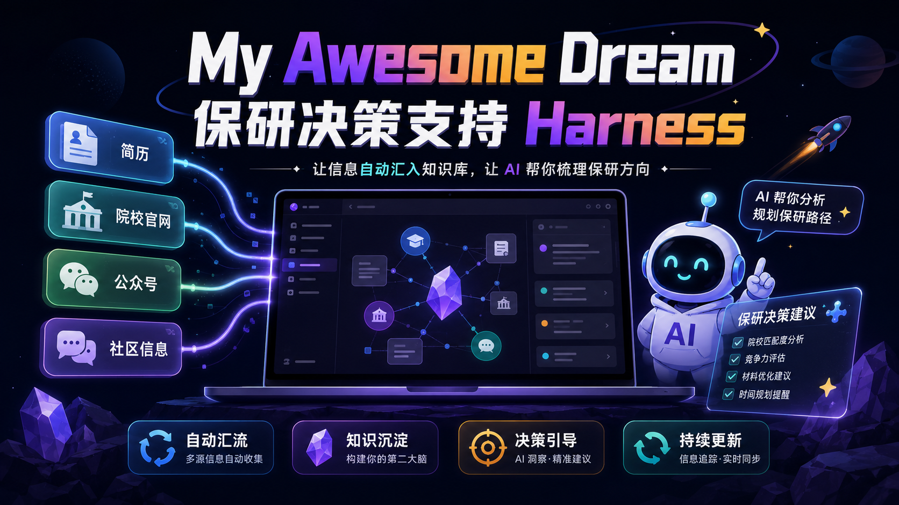
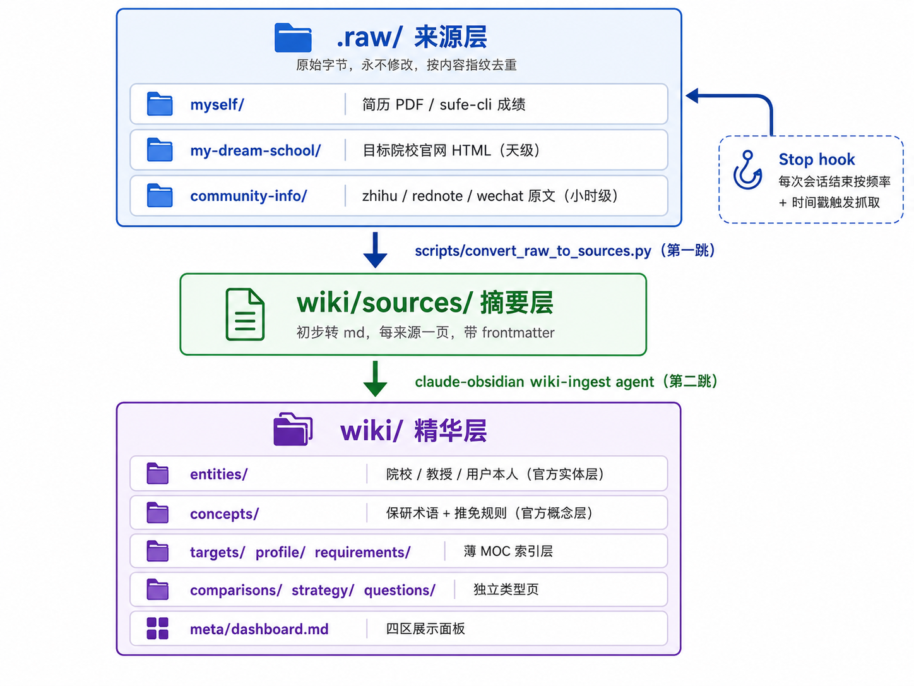

# My Awesome Dream · 保研决策支持 Harness



> 把"我应该保研去哪、有没有资格、什么时候该做什么"这些**靠信息差和记忆力才能答好的问题**，变成一个会自己跑、会自己记、会自己深挖你的第二大脑。
>
> 本项目将 **简历、目标院校官网、公众号、社区信息自动汇入 Obsidian 知识库，Claude 据此给你决策建议，并在 grill-me-study 的 relentless 追问里帮你厘清保研方向。**

---

## 目录

- [系统架构](#系统架构)
- [系统优势](#系统优势)
- [使用方式](#使用方式)
- [情报抓取](#情报抓取)
- [10 个应用案例](#10-个应用案例)
- [第三方技术与致谢](#第三方技术与致谢)
- [项目状态](#项目状态)

---

## 系统架构

三层单向数据流，任何 skill / 脚本都**不准越层直写**——这是整个系统的地基。



### 关键设计

- **`.raw/` 是证据层，永不修改**。文件名用内容指纹，已抓过的内容不会落第二份，操作系统层就拦住重复。可读元数据放在同目录 `.meta.yaml`。
- **两个工作目录隔离开发/使用**：开发目录只产出模板与空骨架（即 release 源），使用者在外部克隆目录灌简历、跑 grill、积累问答；克隆目录只拉不推，个人数据不污染项目仓库。
- **路 C：官方实体层 + 薄业务索引层**。实体页统一写 `entities/`、概念页统一写 `concepts/`（与上游 claude-obsidian 对齐，官方 `wiki-ingest` / `wiki-lint` agent 无需改造即可复用）；`targets/` `profile/` `requirements/` 不装实体，用 MOC + Dataview 聚合。
- **时效三层**：`current`（当季）/ `historical`（去年时间线，保留不删）/ `stale-suspect`（社区信息可能陈旧）。官方 lint 只查孤儿页/死链，时效语义由自补的检查段处理——**去年的招生时间线永远是财富，不是垃圾**。
- **社区 skill 铁律**：zhihu / rednote / wechat 三个社区 skill 的产物**只能进 `.raw/community-info/`**，绝不直写 `wiki/`。铁律在三个 skill 的 SKILL.md 和 CLAUDE.md 双写，把爆炸半径锁死在证据层。

### 决策流（grill-me-study）

```
   "你觉得你目前的保研竞争力如何？(高/中/低)"
            │
      ┌─────┴─────┐
      高          中/低
      │            │
   盘牌          挖动机
   （手上的牌）   （为什么读研）
      │            │
      └─────┬──────┘
         合流：愿付代价 → 目标学位
            │
   地域 → 院校层 → 时间线 → SWOT
            │
      保研方向卡片
   （定性进 entity / 规划进 strategy）
```

形态 A：relentless 深挖一轮走完决策树；只在关键节点（Q4/Q6/Q8/方向卡片）沉淀进 `wiki/questions/`，断点可续。预设提示词不是必经环节，是深挖到对应分支时可调出的弹药库。

---

## 系统优势

1. **越用越厚的个人知识资产**。`.raw/` 永不修改 + 指纹去重，每一次抓取都是净增量；去年夏令营通知到今年仍是预测今年节奏的依据，**信息只会积累，不会丢**。
2. **自动汇流，零手工搬运**。Stop hook 在你每次和 Claude 聊完结束时，按各来源自己的频率（sufe 周级 / 官网天级 / 社区小时级）决定要不要抓，产物自动进 `.raw/`、自动转 source、自动 ingest。你只管问问题。
3. **官方与社区分层聚合，不被噪音淹没**。同一件事，官方通知和社区帖子有不同可信度和时效。展示面板按 `evidence_tier` 分层展示——"社区归社区、官方分官方、最后综合联动"，谁说了什么清清楚楚。
4. **会深挖、不只回答**。迷茫的学子最缺的不是信息，是被认真追问。grill-me-study 用 relentless 决策树把"我为什么读研"追问到底，产物沉淀成方向卡片 + 高分问答进面板。
5. **结构隔离，交付干净**。开发工具、个人数据、release 骨架物理三轨分离。打包 release 给别人时，你的简历、你的目标院校、你的问答**一行都不会泄漏**。
6. **站在巨人肩膀上**。数据管理复用 claude-obsidian，社区抓取复用成熟的 zhihu/rednote/wechat skill，上财学生还复用 sufe-cli。自研的只有"保研领域层 + 调度 + 决策引导"。

---

## 使用方式

> [!IMPORTANT]
> 第一次只需记住 `/init`：配置完成后 Claude Code 会主动继续首次全量采集，不需要你再记一串命令。以后想立即完成一轮“采集 + 沉淀 + 汇报”，运行 `/full-collect`。每轮结束后，请打开 [wiki/meta/dashboard.md](wiki/meta/dashboard.md) 查看保研驾驶舱。

### 🚀 首次使用

Clone 后第一步：

```
/init
```

它会引导你：

1. 检查环境依赖（Python / uv / Node + cheerio；是否上财学生 → 决定是否装 sufe-cli）
2. 提醒登录社区来源账号（小红书 `uv run rednote auth`、知乎浏览器登录保存 Cookie、sufe `sufe auth`）——未登录则对应抓取不生效
3. 填写 `config.yaml`：你本人信息 + **所有需要监视的网站**（目标院校官网可配多个、公众号、社区关键词、zhihu 收藏夹 URL、rednote UID）
4. 生成空骨架（`.raw/` + `wiki/` 种子概念页 + `preset-prompts.md` 占位）
5. 提示你把第一份简历放进 `.raw/myself/resume/`，触发首次 ingest（建立你的个人画像 entity）
6. **自动开始首次全量信息采集**——除非你明确选择暂不采集，`/init` 会直接接着执行 `/full-collect`：逐一跑官网/公众号/知乎/小红书/成绩（按 config 启用），完成 source 转换与 wiki-ingest
7. 收到统一汇报：每个来源采集了多少、沉淀了多少 entity/concept、哪些来源失败或跳过、dashboard 哪些区有变化
8. 引导运行下一步 `/grill-me-study`，并请你**现在就在 Obsidian 中打开 [wiki/meta/dashboard.md](wiki/meta/dashboard.md)** 查看保研驾驶舱

### 日常使用

| 你想做什么 | 怎么说 |
|-----------|--------|
| 把一份原始材料纳入知识库 | 把文件放进 `.raw/`，说 `ingest <文件名>` |
| 直接问保研问题 | 直接问，Claude 先读 `hot → index → 子索引 → 具体页` |
| **完整采集 + 沉淀 + 汇报** | `/full-collect`（也可说“根据我的 config.yaml，帮我做一次全量信息采集”） |
| 不等 hook、立即抓取情报 | "帮我抓取 XXX"（抓官网 / 搜知乎 / 更新绩点 / 搜公众号） |
| 深挖保研方向 | `/grill-me-study` |
| 健康检查（孤儿页/死链/时效） | `lint the wiki` |
| **查看最终结果** | 在 Obsidian 打开 [wiki/meta/dashboard.md](wiki/meta/dashboard.md) |

### 情报抓取

增量抓取是**自动**的。每次你和 Claude 聊完、会话结束时，Stop hook 自动触发 `scripts/hook_fetch.py`：读取 `config.yaml` 里各来源的频率 + 上一次抓取时间戳，时间到了就把新原始材料抓进 `.raw/`。Stop hook 不会在后台冒充 Claude 完成语义提炼；要立刻跑完 source 转换、wiki-ingest 和结果汇报，请运行 `/full-collect`。

**各来源抓取前提：**

| 来源 | 频率 | 前提条件 |
|------|------|---------|
| 目标院校官网 | 天级 | `config.watched_pages` 中填入 URL（Playwright 浏览器自动抓 HTML） |
| 公众号文章 | 小时级 | `config.wechat.keywords` 中填入关键词 |
| 知乎收藏夹 | 小时级 | `config.community.zhihu_collection_url` 中填入收藏夹 URL；**需先在浏览器登录知乎并保存 Cookie** |
| 小红书 | 小时级 | `config.community.rednote_user_id` 中填入用户 ID；**需先运行 `uv run rednote auth` 登录** |
| 成绩/绩点 | 周级 | 仅上财学生；`config.is_sufe=true` 且已运行 `sufe auth` |

**手动抓取**：想不等 hook 到时间立刻抓 → 和 Claude 说"帮我抓取 XXX"（例如"帮我抓取目标院校官网""帮我搜知乎收藏夹""更新我的绩点"），Claude 会跑对应 skill 直接拉，产物同样进 `.raw/`。

**首次全量采集**：`/init` 填完配置并 ingest 首份简历后会自动继续；无需记额外命令。若当时选择跳过，或以后想立即刷新全部来源，运行 `/full-collect`。它会强制忽略日常频率，跑所有已启用来源，完成 `.raw → source → entity/concept`，最后汇报“采集了什么 → 沉淀了什么 → dashboard 哪些区变化 → 哪些来源需要补救”。

**数据流向**：`.raw/` 新文件 → `scripts/convert_raw_to_sources.py` 转 `wiki/sources/` md → Claude 的 wiki-ingest agent 提炼进 `wiki/concepts`、`wiki/entities` → 满足 dashboard 过滤条件的条目出现在面板。

每轮完整采集结束后都做同一件事：**在 Obsidian 中打开 [wiki/meta/dashboard.md](wiki/meta/dashboard.md)**。这是整个系统的默认结果入口。

想要停用某个来源的自动抓取 → 将 config 中对应关键词/URL 留空或注掉即可。

### 10 个应用案例

以下 10 个案例覆盖从初始化到精进的全生命周期，按推荐顺序排列。

**1. 初次上手：搭好你的保研驾驶舱**

```bash
/init
```
依次完成：依赖检查 → 登录小红书/知乎/sufe → 填 config.yaml（填入你的院校、目标院校 URL、公众号关键词、知乎收藏夹、小红书 UID）→ 投简历。随后 `/init` 会自动执行首次 `/full-collect`；你会收到采集量、沉淀量、失败来源和 dashboard 更新区的完整汇报。完成后立即在 Obsidian 打开 [wiki/meta/dashboard.md](wiki/meta/dashboard.md)——你的保研驾驶舱已经亮了。

**2. 每周情报更新：你什么都不用做**

每次和 Claude 聊完、会话结束时，Stop hook 自动跑 `scripts/hook_fetch.py`：检查各来源上次抓取时间 + 频率（官网天级、社区小时级、sufe 周级），时间到了就把新证据放进 `.raw/`。想把 pending 证据立即提炼并查看统一汇报时运行 `/full-collect`，然后打开 [dashboard](wiki/meta/dashboard.md)。

**3. 突然想看看目标院校官网有没有新通知**

不等 hook 到时间——直接运行：
```
/full-collect
```
Claude Code 用 Playwright 打开 config 里所有 `watched_pages` URL，HTML 落地 `.raw/`，转为 source md 并提炼 entity/concept。只有满足 `current + official` 的条目才进入 dashboard 第 1 区，最终汇报会给出真实命中数量。

**4. 搜知乎保研经验帖并沉淀**

确保 config 中 `community.zhihu_collection_url` 已填，对 Claude 说：
```
帮我搜知乎收藏夹
```
Claude 抓收藏夹中所有文章的正文 + 图片 → 落 `.raw/community-info/zhihu/` → ingest 提炼文章里提到的教授、项目、概念进实体/概念页。社区 source 保留在 `wiki/sources/`，不会被误报为 dashboard 的“官方来源”；你可以据此继续提问，优质问答评分后进入 dashboard 第 4 区。

**5. 简历投进去，建立个人画像**

把简历（PDF/DOCX）拖进 `.raw/myself/resume/` 后说：
```
ingest 我的简历
```
Claude 把简历转成 source md，提炼你的学校/专业/绩点/科研/竞赛/技能进 `wiki/entities/` 里的用户本人 entity（`entity_type: person` + `tag: user-self`）。之后说：
```
帮我更新个人 SWOT
```
Claude 根据 entity 数据生成 SWOT 进 dashboard 第 3 区。

**6. 用 grill-me-study 厘清保研方向**

```
/grill-me-study
```
Claude 逐层深挖：你的保研竞争力自评 → 读研动机 → 愿付代价 → 目标学位 → 目标院校层 → 地域 → SWOT → 产出方向卡片。每个关键节点沉淀进 `wiki/questions/`，dashboard 第 4 区只显示你打 4 分以上的回答。

**7. 用预设提示词做定点深挖**

在 Claudian（Obsidian 内的 realclaudian 插件）中问一条 `wiki/meta/preset-prompts.md` 里的预设提示词——例如 `preset/competitiveness-self`（"根据你的各维度逐一盘点保研竞争力"）。Claudian 基于第二大脑回答后，回复自动沉淀进 `wiki/questions/`，frontmatter 带 `prompt_type: preset`、`preset_slug: competitiveness-self`、`score`。给高分的回复会出现在 dashboard 第 4 区。

**8. 自由提问并沉淀高分回答**

在 Claudian 中问任意保研问题——"上财金院和复旦经院哪个更适合我？"。Claudian 结合你的个人画像和已 ingest 的官方/社区信息作答。回复沉淀进 `wiki/questions/`（`prompt_type: freeform`），你打完分后如果 ≥ 4 分会出现在 dashboard 第 4 区。

**9. 定期健康检查**

```
lint the wiki
```
Claude 跑官方 wiki-lint（孤儿页/死链/缺口）+ 自补时效检查（current/historical/stale-suspect）。去年的招生通知不会删——只是标 `historical` 降到历史参考区，时间线参考价值全保留。

**10. 导出 release 给同学用**

项目开发完成后运行：
```
python scripts/build_release.py --zip
```
生成 `release/my-awesome-dream-YYYY-MM-DD.zip`，包含工具轨 + 空骨架 + 种子概念页 + 12 条预设提示词，**不含任何个人数据**。同学 clone 后走同样的 `/init` → 自动 `/full-collect` → 打开 dashboard → `/grill-me-study` 路径。

### 目录速览

```
.raw/                 原始材料（永不修改）—— skill 产物只准写这一层
.archive/             冷来源归档（lint 时迁入）
wiki/                 知识库本体
  meta/dashboard.md         展示面板（四区 Dataview，Claudian 不嵌入）
  meta/preset-prompts.md    预设提示词清单
  entities/                 所有实体（院校/教授/你本人）
  concepts/                 所有概念（保研术语 + 推免规则）
  sources/                  每来源一页摘要
  questions/                Claudian/grill 回复沉淀（带评分）
config.yaml           配置（监视的网站、公众号、社区关键词）
scripts/              hook_fetch.py + convert_raw_to_sources.py
.claude/skills/       技能（init / grill-me-study / 社区 skill / sufe-* 等）
_templates/           Templater 模板
```

完整结构与约定见 [CLAUDE.md](CLAUDE.md)，设计脉络与 grill 共识见 [Project Develop Plan.md](Project%20Develop%20Plan.md)。

---

## 致谢

本系统自研的只有"保研领域层 + 调度管线 + 决策引导"，大量复用了优秀开源项目：

### 核心引擎

- **[claude-obsidian](https://github.com/AgriciDaniel/claude-obsidian)** — 第二大脑知识库的骨架与 ingest/lint agent。本系统的 `wiki/` 结构、`wiki-ingest` / `wiki-lint` agent、路 C 的"官方实体层"理念均源于此。
- **[Claude Code](https://claude.com/claude-code)** — Harness 主体，提供 skill、hook、agent、Stop hook 调度等能力。

### 数据来源 skill

- **[zhihu-fetch](https://github.com/handsomestWei/zhihu-fetch-skill)** — 知乎收藏夹与文章抓取（API/Playwright 多级降级、Cookie 保活、批量正文与图片）。
- **[RedNote-Skill](https://github.com/WJJ1577/RedNote-Skill)** — 小红书数据采集、运营分析、舆情监控。
- **[wechat-article-search](https://skillhub.cn/skills/wechat-article-search)** — 微信公众号文章搜索（标题/摘要/发布时间/来源/链接）。
- **[sufe-cli](https://github.com/ChengJiale150/sufe-cli)** — 上海财经大学学生绩点/课程成绩/Canvas/IC 空间业务（上财学生可选）。

### Obsidian 插件（随 release 预置）

- **[Dataview](https://github.com/blacksmithgu/obsidian-dataview)** — 展示面板四区的动态聚合查询。
- **[Templater](https://github.com/SilentVoid13/Templater)** — 各类页面模板。
- **[realclaudian](https://github.com/)** — Claudian 第二大脑问答入口（独立插件，不嵌入面板）。
- **[obsidian-tasks](https://github.com/obsidian-tasks-group/obsidian-tasks)** — 任务管理。

### 开发陪伴

- **[claude-md-management](https://github.com/anthropics/claude-md-management)** — 演进 CLAUDE.md。
- **[skill-creator](https://github.com/anthropics/skill-creator)** — 制作新 skill。

### 运行时与工具链

- **Python ≥ 3.12 + [uv](https://github.com/astral-sh/uv)** — 依赖与虚拟环境。
- **Node.js + [cheerio](https://github.com/cheeriojs/cheerio)** — 公众号文章解析。
- **[Playwright](https://github.com/microsoft/playwright)** — 目标院校官网抓取与反爬。
- **[pandoc](https://github.com/jgm/pandoc)**（可选）— PDF/DOCX/HTML → markdown 转换。

> 三社区 skill 遵循本系统的"社区域铁律"——产物只进 `.raw/community-info/`，禁写 `wiki/`，避免破坏项目结构。详见各 skill 的 SKILL.md 与 CLAUDE.md。

---

## 项目状态

- **当前**：全量落地——来源层管线、处理层 MOC、展示层面板、Stop hook 调度、种子概念页（5 篇）、init skill、`hook_fetch.py` 四个 fetch_* 均接通真实 CLI（wechat/sufe/官网 全自动可达，zhihu/rednote 填 config 入参后自动抓）、rednote 内部已改暴露 `--output-dir`/`REDNOTE_OUTPUT_DIR`、release 打包脚本已通（`scripts/build_release.py`）、预设提示词清单 12 条已录入（`wiki/meta/preset-prompts.md`，覆盖 decision tree 全路径）
- **运行时可迭代**：grill-me-study 深挖实践后可按需调优提示词措辞、decision tree 分支权重、展示面板 dataview 字段过滤条件

设计与 grill 共识完整记录在 [Project Develop Plan.md](Project%20Develop%20Plan.md)。
